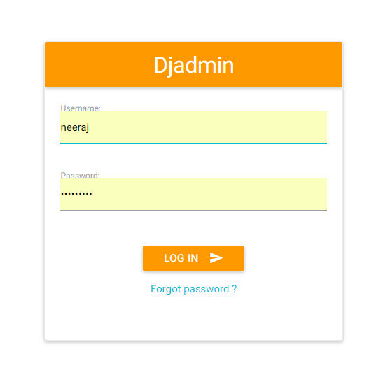
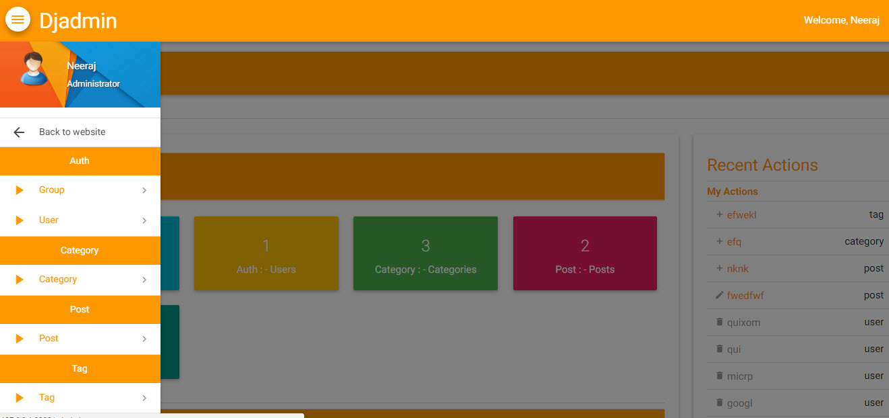
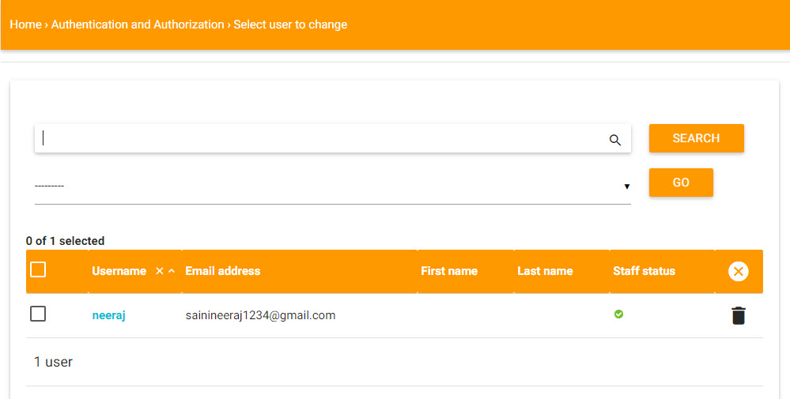

===============
Djadmin
===============

Djadmin is a django admin theme

.. image:: https://img.shields.io/pypi/v/djadmin.svg
    :target: https://pypi.python.org/pypi/djadmin

Overview
========

- Visior - Add visitor model for administrator location on each time login and show graph of login device

- Forget Password Option - Admin can enable or disable forget password option on admin login page

- Theme Color - Change theme color of admin

- Admin Header Title - Change django admin header title

Documentation
=============

- Installation -
   * Run ::

      pip install djadmin

   * Add 'djadmin' to your INSTALLED_APPS just before 'django.contrib.admin' ::

      'djadmin',

   * Add middleware in MIDDLEWARE_CLASSES list ::

     'djadmin.middleware.DJMiddleware',

   * Add in urls.py ::

      url(r'^admin/', include('djadmin.urls')),

   * Run 'python manage.py migrate' for make visitor model ::

      python manage.py migrate

   * Run 'python manage.py collectstatic' ::

      python manage.py collectstatic

   * Now you have successfully install djadmin in your project

- Customization -
   * Add 'ALLOW_FORGET_PASSWORD_ADMIN' for Enable Forget password option in login page, default: Disable ::

        ALLOW_FORGET_PASSWORD_ADMIN = True
        EMAIL_USE_TLS = True
        DEFAULT_FROM_EMAIL = '<Email ID>'
        SERVER_EMAIL = '<Email ID>'
        EMAIL_HOST = '<smtp.example.com>'  #Ex: Gmail : smtp.gmail.com
        EMAIL_PORT = <Post Number>    #Ex: Gmail : 587
        EMAIL_HOST_USER = '<Email ID>'
        EMAIL_HOST_PASSWORD = '<Password>'
        EMAIL_BACKEND = 'django.core.mail.backends.smtp.EmailBackend'

   * Add 'ADMIN_COLOR_THEME'  for change admin color. you can write directly name of color. default: cyan ::

        ADMIN_COLOR_THEME = 'red'

   * Add 'ADMIN_HEADER_TITLE' for change admin header title ::

        ADMIN_HEADER_TITLE  = 'Djadmin Administrator'

Screenshot
==========

License
=======

Djadmin is an Open Source project licensed under the terms of the `MIT license <https://github.com/sainipray/djadmin/blob/master/LICENSE>`_

