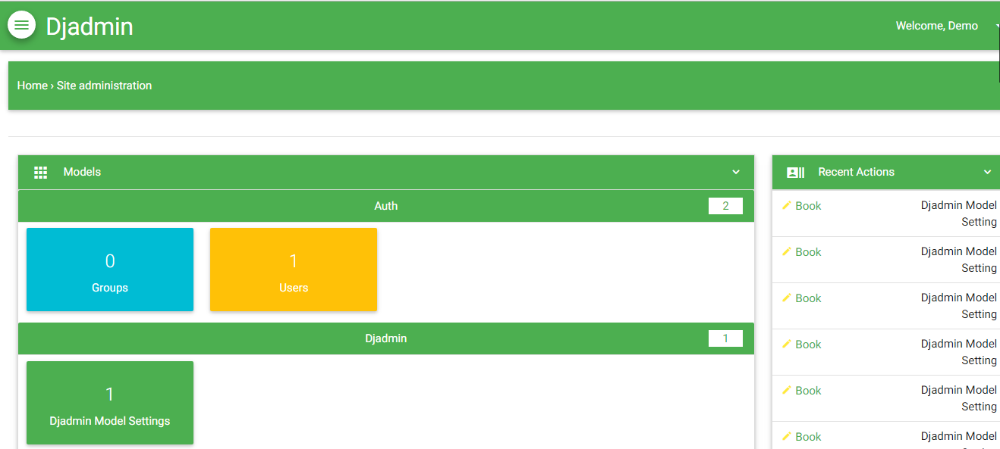
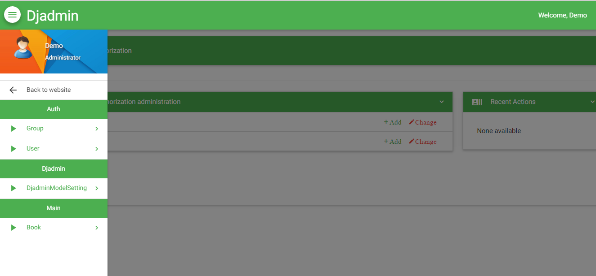
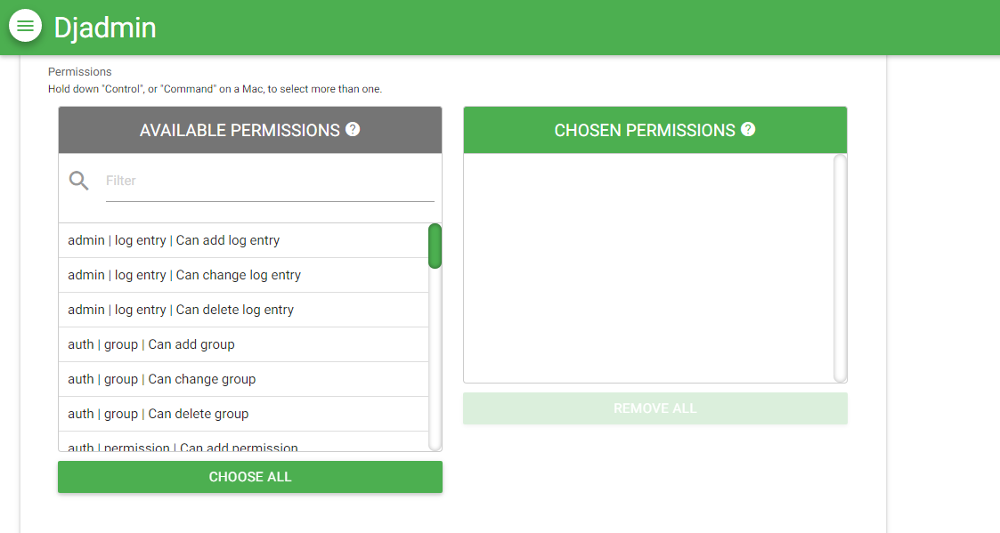
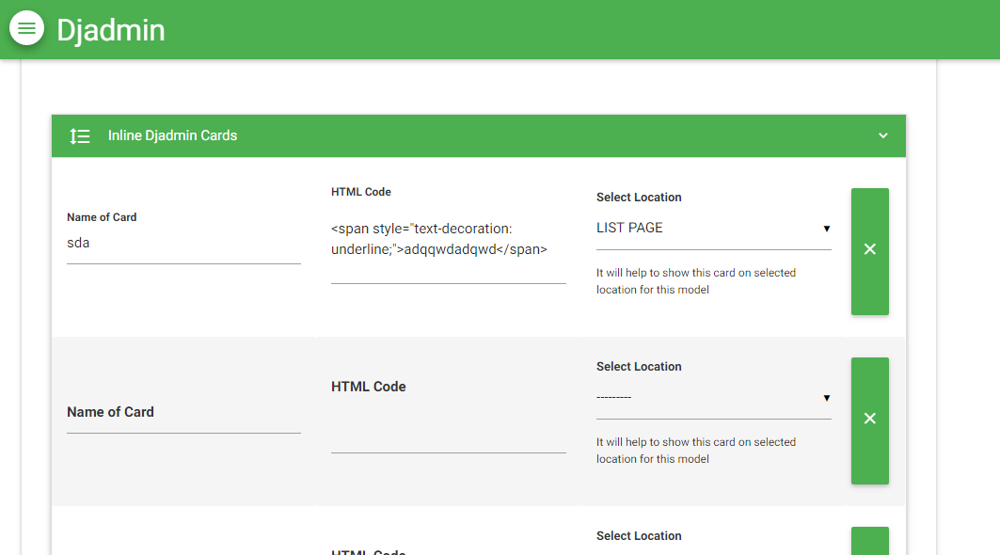
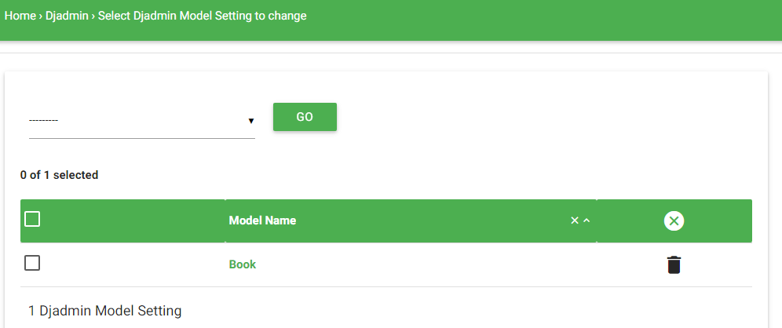

===============
Djadmin
===============

Djadmin is a django admin theme

.. image:: https://img.shields.io/pypi/v/djadmin.svg
    :target: https://pypi.python.org/pypi/djadmin

.. image:: https://api.travis-ci.org/sainipray/djadmin.svg
    :target: https://travis-ci.org/sainipray/djadmin/

.. image:: https://img.shields.io/pypi/pyversions/djadmin.svg
    :target: https://travis-ci.org/sainipray/djadmin/

Overview
========

  **"NEW UPDATES"**

- Added Sortable in admin **change list** page.

- Added Language dropdown.

- Added Configuration Page in admin (In Development).

- Added Some fields in DjadminModelSettings Model.

- Fixed Bugs

  **" VERSION 1.1.3 "**
- Dynamic Django Admin - Admin options like : list_display, list_display_link etc will work dynamic.

- Material Design - Djadmin is based on material design.

- Djadmin Cards -  It will show html design card on "Change list" or "Change form" page according to model.

- Visior - Add visitor model for administrator location on each time login and show graph of login device

- Forget Password Option - Admin can enable or disable forget password option on admin login page

- Theme Color - Change theme color of admin

- Admin Header Title - Change django admin header title

- Image preview or File information on change form if form has Image field or File field

- Added "Next" and "Prev" for change form. It will display when model have 2 or more rows data and model has default django primary key field "id"

Documentation
=============

- Installation -
   * Run ::

      pip install djadmin

   * Add 'djadmin' to your INSTALLED_APPS just before 'django.contrib.admin' ::

      'djadmin',

   * Add middleware in MIDDLEWARE_CLASSES list ::

     'djadmin.middleware.DJMiddleware',

   * Add in urls.py ::

      url(r'^admin/', include('djadmin.urls')),

   * Run 'python manage.py migrate' for make visitor model ::

      python manage.py migrate

   * Run 'python manage.py collectstatic' ::

      python manage.py collectstatic

   * Now you have successfully install djadmin in your project

- Customization -
   * Add 'DJADMIN_DYNAMIC_FIELD_DISPLAY' for Enable Django admin dynamic options for models, After enable this option it's need to "migrate" model. default: False ::

       DJADMIN_DYNAMIC_FIELD_DISPLAY = True

   * Inherit DjadminMixin in your admin class of model, No need of inherit 'admin.ModelAdmin'::

      from djadmin.mixins import DjadminMixin
      from main.models import Book
      @admin.register(Book)
      class BookAdmin(DjadminMixin):
          pass

   * Another way for register DjadminMixin to Model ::

      from djadmin.mixins import DjadminMixin
      from main.models import Book
      admin.site.register(Book, DjadminMixin)

   After that you will see DjadminMixin Inherit model name in "DjadmiModelSetting" of admin like below snapshot
   then change field values with given field.You will get field to show

   Note: If any field already define in your admin class of model then that field value in DjadmiModelSetting will not work for field.

   * Add 'DJADMIN_FIELD_DEPTH' for define field depth.When any model has ForeignKey relation with another model and next model also has Foreignkey relation with another that define relation depth.default = 1 ::

        DJADMIN_FIELD_DEPTH = 2

        Ex:
        class Publisher(models.Model):
            name = models.CharField(max_length=30)

        class Book(models.Model):
            pub = models.ForeignKey(Publisher)

        class Author(models.Model):
            book = models.ForeignKey(Book)

   So, If we have Author model then depth 2 will create field in Author model:   "**book__pub__name**" for access Publisher name from Author model instance.

   * Add 'ALLOW_FORGET_PASSWORD_ADMIN' for Enable Forget password option in login page, default: Disable ::

        ALLOW_FORGET_PASSWORD_ADMIN = True
        EMAIL_USE_TLS = True
        DEFAULT_FROM_EMAIL = '<Email ID>'
        SERVER_EMAIL = '<Email ID>'
        EMAIL_HOST = '<smtp.example.com>'  #Ex: Gmail : smtp.gmail.com
        EMAIL_PORT = <Port Number>    #Ex: Gmail : 587
        EMAIL_HOST_USER = '<Email ID>'
        EMAIL_HOST_PASSWORD = '<Password>'
        EMAIL_BACKEND = 'django.core.mail.backends.smtp.EmailBackend'

   * Add 'ADMIN_COLOR_THEME'  for change admin color. you can write directly name of color. default: cyan ::

        ADMIN_COLOR_THEME = 'red'

   * Add 'ADMIN_HEADER_TITLE' for change admin header title ::

        ADMIN_HEADER_TITLE  = 'Djadmin Administrator'

Demo
==========
   * URL : https://djadmin.herokuapp.com/admin/

   * Username : test1234

   * Password : test1234

Screenshot
==========

License
=======

Djadmin is an Open Source project licensed under the terms of the `MIT license <https://github.com/sainipray/djadmin/blob/master/LICENSE>`_
